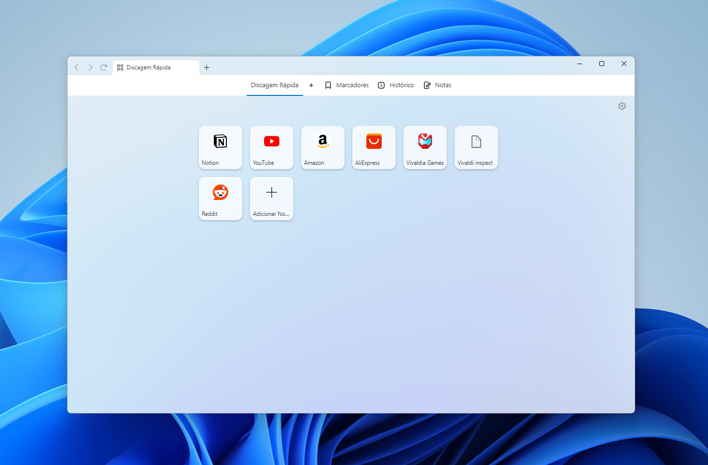
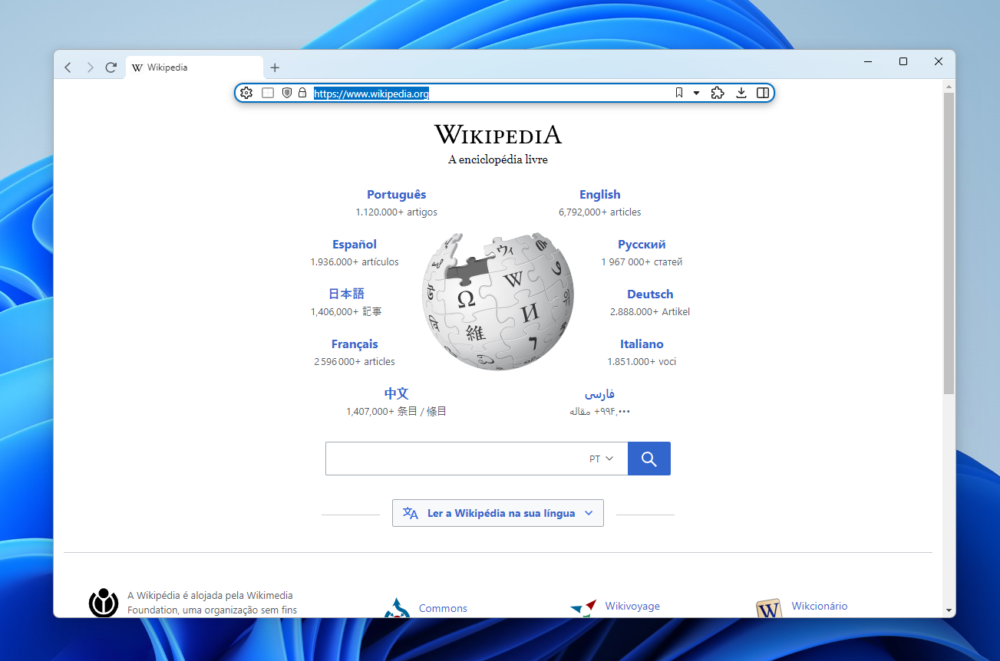

# Better Vivaldi

html, css, js modifications to improve Vivaldi experience

## Features TODO list

- [x] Add Mica effect
- [x] Minimalist tabbar experience (like Safari)
- [x] UI improvements and fixes in tabbar
- [ ] Published Vivaldi themes for Mica

Hotfixes

- [ ] Update browser 

### Mica effect

Features:

- The blur and parallax effects are as identical as possible to the original
- selected/unselected window animation and background change
- Windows' light/dark modes will change the mica brightness to match original effect
- When user changes Windows wallpaper, Vivaldi will update sa well

### minimalist topbar

